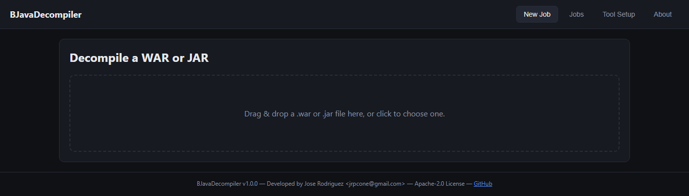
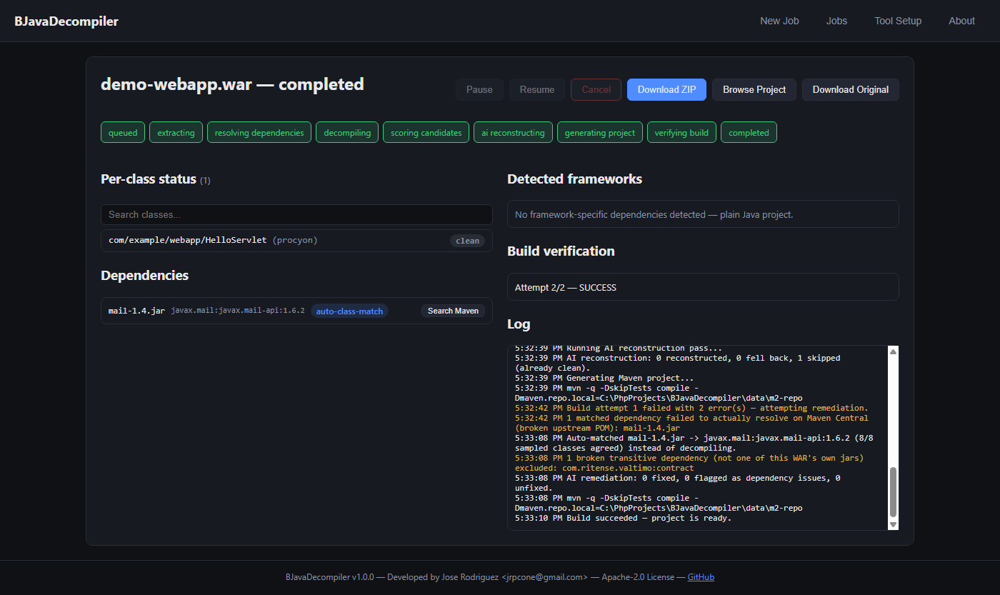
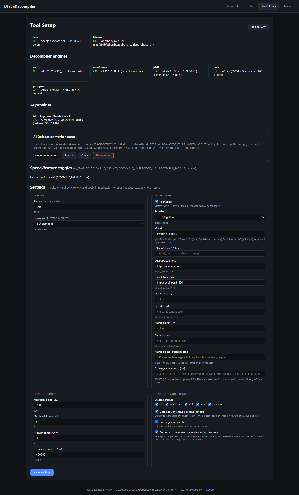
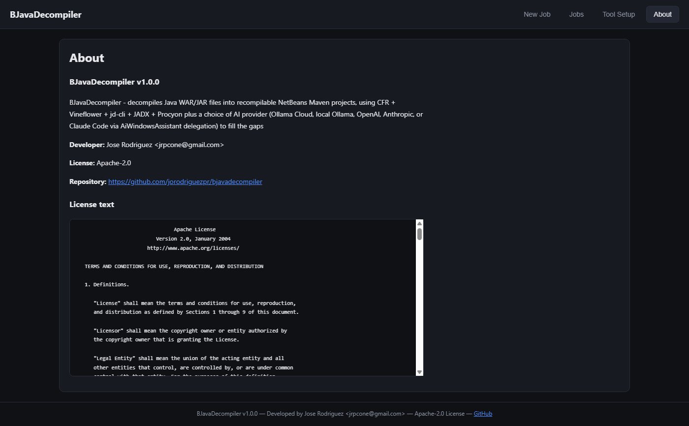

# BJavaDecompiler

Decompiles a Java WAR or JAR into a complete, recompilable **NetBeans Maven project** —
combining five open-source decompilers (CFR, Vineflower, jd-cli, JADX, Procyon) with a choice of
AI provider (Ollama Cloud, local Ollama, OpenAI, Anthropic, or Claude Code via AiWindowsAssistant
delegation) to rename obfuscated symbols, reconstruct `pom.xml` dependency coordinates, detect
the original framework stack, fix decompiler failures so the output actually compiles, and add
explanatory comments.

Goal: the recompiled WAR is **functionally equivalent** to the original — not byte-identical,
which isn't possible (compiler version, debug info, etc. always differ) and isn't the point.

## Screenshots

| | |
|---|---|
|  |  |
| Upload a WAR or JAR | Job detail — pipeline stepper, dependency auto-match, live command log |
|  |  |
| Tool Setup — engines, AI provider status, full `.env` settings editor | About — license and developer info |

(Screenshots use a small anonymized sample WAR — no real project data.)

## Requirements

- Node.js 18+
- **JDK 17+** on `PATH` (required by the decompiler engines, and to run `mvn`)
- **Apache Maven** on `PATH` (used for the final recompilation-verification step)

The app checks both at startup and via `GET /api/system/status` — the Upload button in the web
UI stays disabled with an explanation if either is missing.

## Setup

Run the installer for your platform — it checks prerequisites, runs `npm install`, creates
`.env` from `.env.example` if it doesn't exist yet, and builds the project:

```
# Linux/macOS
./scripts/install.sh

# Windows (PowerShell)
.\scripts\install.ps1
```

Or do it by hand:

```
npm install
cp .env.example .env   # then set an AI provider — see "AI provider" below
npm run build
npm start
```

Open `http://localhost:7795` (or whatever `PORT` is set to). On first use, visit **Tool
Setup** and click Install for each decompiler engine — they're downloaded on demand (from Maven
Central for CFR/Vineflower/Procyon, GitHub Releases for jd-cli/JADX) and checksum-verified
against the source's own published hash where available, never silently.

## AI provider

Five interchangeable backends (`AI_PROVIDER`):

- **Ollama Cloud** (default) — set `OLLAMA_CLOUD_API_KEY`. Fast, no local hardware needed, costs
  per call.
- **Local Ollama** — `AI_PROVIDER=ollama-local`, run `ollama serve`, and
  `ollama pull qwen2.5-coder:7b` (the default local model — any other pulled model works via
  `AI_MODEL`). Free, works offline, but noticeably slower per call, especially on a WAR with many
  bundled third-party jars.
- **OpenAI** — `AI_PROVIDER=openai`, set `OPENAI_API_KEY`. Standard Chat Completions API,
  `gpt-4o-mini` by default.
- **Anthropic** — `AI_PROVIDER=anthropic`, set `ANTHROPIC_API_KEY`. Talks directly to
  Anthropic's Messages API with your own key — `claude-sonnet-5` by default, no
  AiWindowsAssistant or desktop Claude Code CLI involved at all. Use this instead of AI
  Delegation below if you'd rather pay for API access directly than run a second app.
- **AI Delegation (Claude Code)** — `AI_PROVIDER=ai-delegation`. Doesn't call any AI API from
  this app at all: it queues the prompt and hands it to a local
  [AiWindowsAssistant](https://github.com/jorodriguezpr/aiwindowsassistant) instance polling
  in the background, which runs it through your own authenticated Claude Code CLI and posts the
  result back. Useful when you already pay for a Claude Code subscription and would rather use
  that than a separate API key. Set up from **Tool Setup → AI Delegation worker setup**: reveal/
  copy the auto-generated key into AiWindowsAssistant's `.env` as `BJAVADECOMPILER_URL` +
  `BJAVADECOMPILER_WORKER_API_KEY`, and the status card shows whether it's actively polling.
  These prompts are pure text reconstruction with no server access or destructive tool calls, so
  AiWindowsAssistant runs them unattended (no Telegram approval tap) — still under the same
  read-only Claude Code hook as its other unattended runs, since the prompt content itself is
  built from AI-reconstructed decompiled bytecode (untrusted text, even though the task is
  harmless). `AI_DELEGATION_TIMEOUT_MS` (default 15 min) bounds how long a call waits for the
  desktop worker to pick it up and finish.

Set `AI_ENABLED=false` to force the zero-AI path entirely, regardless of provider — decompiler-
winner output is kept as-is, deterministic (no-AI) remediation still runs, nothing waits on an
LLM call.

Everything under **Tool Setup → Settings** in the web UI is editable from the browser and
applies immediately (no restart) — see `.env.example` for the full list, or the settings form
itself for grouped, labeled fields.

## Speed / feature toggles

A WAR with many bundled third-party ("addon") jars can take a long time once a slow local model
is doing the AI passes. Trade completeness for speed with:

| Env var | Default | Effect |
|---|---|---|
| `DECOMPILE_ENGINES` | all 5 | Comma list to restrict which engines run at all, e.g. `cfr,vineflower`. |
| `DECOMPILE_UNRESOLVED_LIBS` | `true` | Set `false` to stop decompiling+AI-cleaning every unresolved third-party jar (the biggest lever on a WAR with many bundled libs) — they fall back to an opaque install-file placeholder instead. |
| `DECOMPILE_PARALLEL` | `false` | Run the enabled engines concurrently instead of sequentially — faster on multi-core machines, higher peak memory. |

## Auto-matching unresolved dependencies

When `pom.properties`, a SHA-1 lookup, and a filename-based guess all fail to identify a bundled
jar (`AUTO_MATCH_UNRESOLVED_DEPS`, default on), it searches Maven Central for several of the
jar's own classes and votes across the results — a single class name alone is noisy (a
shading/mocking jar can outrank the real library for any one specific class), but the real owning
library is what consistently shows up across many different classes from the same package.
Confirmed against real cases where the filename-guess produced a nonsense match:

| Jar | Filename-guess would find | Auto-match by class search finds |
|---|---|---|
| `mail.jar` | an unrelated `com.ritense.valtimo:mail` | `javax.mail:javax.mail-api:1.6.2` |
| a `net.sf.json.*`-packaged jar | nothing usable | `net.sf.json-lib:json-lib:1.1` |

Results are always marked `auto-class-match` confidence (never presented as certain as a SHA-1
hit) and listed in `BJAVADECOMPILER-NOTES.md` for review — the manual "Search Maven" button in
the **Dependencies** panel still works on these too if you want to pick a different match.

## How it works

1. **Extract** — only the WAR/JAR's own application classes get decompiled
   (`WEB-INF/classes` for a WAR, or the whole jar). `WEB-INF/lib/*.jar` entries become real
   Maven `<dependency>` entries instead of vendored source.
2. **Resolve dependencies** — each lib jar's real Maven coordinates are found via its embedded
   `pom.properties`, a SHA-1 lookup against Maven Central, a filename-based search, or (last
   resort) voting across several of the jar's own classes — in that order of confidence. Anything
   still unresolved can be decompiled and inlined as real source (see `DECOMPILE_UNRESOLVED_LIBS`
   above), or fixed manually from the **Dependencies** panel on the job page: search Maven Central
   by a class name found inside the jar (same idea as NetBeans' "Search in Repositories" for a red
   unresolved import) and apply the real coordinate.
3. **Detect frameworks** — Spring (Boot/MVC/WebFlux/Core), Struts, Hibernate, JPA/EJB, JSF,
   Jakarta EE, and more, from dependency coordinates and descriptor files (`web.xml`,
   `persistence.xml`, etc.) — surfaced in the UI and `BJAVADECOMPILER-NOTES.md`, and used to pick
   the right `pom.xml` plugins and NetBeans run/debug actions.
4. **Decompile** — every engine in `DECOMPILE_ENGINES` runs independently against the app's own
   classes.
5. **Score** — per class, pick whichever engine's output has the fewest decompiler-failure
   markers and the most sane brace structure. No AI involved in this step.
6. **AI reconstruction** — only classes with failure markers or obfuscated-looking names get
   sent to the configured AI provider, to rename symbols, patch decompiler artifacts, and add
   comments. Cleanly-decompiled, normally-named classes are left untouched.
7. **Generate project** — a standard Maven layout NetBeans opens natively (`nbactions.xml` +
   `nbproject/project.xml` included, with `spring-boot:run` or `exec:java` pre-wired where
   applicable), plus a `BJAVADECOMPILER-NOTES.md` documenting every unresolved dependency,
   detected framework, guessed coordinate, and AI-fallback class — the tool stays honest about
   what it couldn't do cleanly.
8. **Verify build** — runs `mvn compile`. On failure, feeds the specific error lines back to
   the AI for a targeted fix, bounded by `MAX_BUILD_FIX_ATTEMPTS` retries. Lands on
   `completed_with_errors` (not `failed`) if it still can't get there — a mostly-compiling
   project with a clear notes file is still a useful result.

Jobs are pause/resume/cancel-able from the web UI and persist as plain JSON files under
`data/jobs/` — no database. A crashed/restarted process picks up any interrupted job as
`paused`, ready for a manual resume. The job page's **Current Activity** box and log show the
exact `java`/`mvn` command in flight at every step, not just a generic per-stage message.
**Clear All Jobs** on the Jobs list deletes every finished job (completed/failed/cancelled) and
its generated project in one go — paused or still-running jobs are always left alone.

## CLI

```
npm run build
node dist/cli.js path/to/app.war
```

Runs the identical pipeline the web UI uses, polling to completion and printing the generated
project's path. Useful for scripting/batch use without the web server.

## License

BJavaDecompiler itself is licensed under the [Apache License, Version 2.0](LICENSE).

CFR (MIT), Vineflower (Apache-2.0), and Procyon (Apache-2.0) are bundled freely. jd-cli/jd-core
is GPLv3 and JADX is Apache-2.0 with some GPL-adjacent history — this tool only ever shells out
to each engine as a separate `java` process, never links or vendors its code, so no copyleft
obligation attaches to BJavaDecompiler's own source.

## Developer

Jose Rodriguez — <jrpcone@gmail.com>
<https://github.com/jorodriguezpr/bjavadecompiler>
